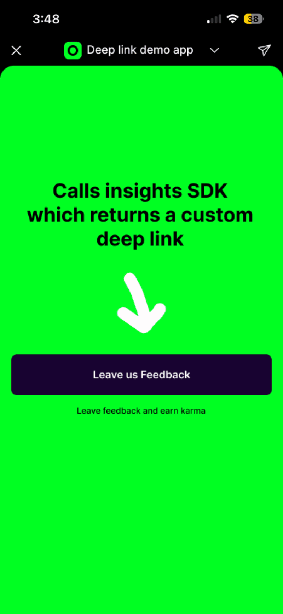

# Welcome to Insights by App Oracle.

Insights is a lightweight server-side SDK for generating secure deep links into the Audience Insights World mini app.

Use Insights to collect feedback and reviews backed by contextual data to support better business decisions. Each signed link ensures responses are securely tied to the experience within your app, guaranteed.

<p align="center">
  
</p>

## Installation

```bash
npm install @app-oracle/insights
```

## Quick Start

```typescript
import { Insights } from '@app-oracle/insights';

// Use a global constant so your app version stays up to date across all links
const APP_VERSION = '1.2.3';

const insights = new Insights({
  apiKey: process.env.APP_ORACLE_API_KEY!,
});

const result = await insights.getFeedbackLink({
  appVersion: APP_VERSION,
  wallet: '0x1234567890abcdef',
  metadata: {
    userId: '12345',
    platform: 'ios',
  },
});

// https://world.org/mini-app?app_id=abc123&path=/leave-feedback/def456
console.log(result.url);
```

> Store your API key in environment variables. This SDK is intended for server-side use — never expose your key in client-side code.

## How It Works

The SDK generates deep links that open the **Insights mini app** — a hosted review and feedback experience powered by App Oracle. When a user taps the link, they're taken to a form pre-filled with the context you provide, making it easy for them to leave meaningful feedback or an app review.

<p align="center">
  
  
</p>
<p align="center">
  
  
</p>

## API Reference

### Constructor

```typescript
new Insights(config: SDKConfig)
```

| Parameter      | Type     | Required | Description                           |
| -------------- | -------- | -------- | ------------------------------------- |
| `apiKey`       | `string` | Yes      | Your App Oracle API key               |
| `baseUrl`      | `string` | No       | Custom API base URL                   |
| `timeout`      | `number` | No       | Request timeout in ms (default 10000) |

### `getFeedbackLink(options)`

Generate a feedback deep link with optional wallet verification and app review request.

```typescript
const result = await insights.getFeedbackLink({
  appVersion: APP_VERSION,
  wallet: '0x1234567890abcdef',
  metadata: {
    userId: 'user_12345',
    feature: 'checkout',
    proUser: true,
  },
});
```

**Options**

| Parameter          | Type              | Required | Description                                                                 |
| ------------------ | ----------------- | -------- | --------------------------------------------------------------------------- |
| `appVersion`       | `string`          | Yes      | Your app version (e.g. `"1.0.0"`)                                          |
| `wallet`           | `string`          | No       | User's wallet address — hashed with SHA-256 before sending                  |
| `metadata`         | `UserMetadata`    | No       | Key-value pairs to store with the feedback (max 4 fields)                   |
| `requestAppReview` | `boolean`         | No       | Request an app review (defaults to `true` when wallet provided)             |
| `redirectUrl`      | `string`          | No       | Deep link to redirect the user after they leave feedback                    |

**Response**

```typescript
interface DeepLinkResponse {
  url: string;         // The deep link to share with users
  expiresAt?: string;  // Expiration timestamp (if applicable)
}
```

### `getReviewLink(options)`

Generate a review-only deep link. Requires a wallet address for user verification.

```typescript
const result = await insights.getReviewLink({
  appVersion: APP_VERSION,
  wallet: '0x1234567890abcdef',
  metadata: { userId: 'user_12345' },
});
```

| Parameter    | Type           | Required | Description                                              |
| ------------ | -------------- | -------- | -------------------------------------------------------- |
| `appVersion` | `string`       | Yes      | Your app version                                         |
| `wallet`     | `string`       | Yes      | User's wallet address (required for review verification) |
| `metadata`   | `UserMetadata` | No       | Key-value pairs to store with the review (max 4 fields)  |
| `redirectUrl`| `string`       | No       | Deep link to redirect the user after they leave a review |

### `getWalletHash(wallet)`

Hash a wallet address using SHA-256. Useful for verifying wallet hashes match the algorithm used internally.

```typescript
const hash = await insights.getWalletHash('0x1234567890abcdef');

// Also available as a standalone import
import { getWalletHash } from '@app-oracle/insights';
```

## Metadata

Metadata lets you attach context to each feedback or review link. This can help you segment responses, trace feedback to specific features, or correlate with your own analytics.

Each link supports up to **4 metadata fields** (this limit may increase in the future). Values can be any of the following types:

```typescript
type UserMetadata = Record<string, string | number | boolean | Date | null>;
```

```typescript
const result = await insights.getFeedbackLink({
  appVersion: APP_VERSION,
  metadata: {
    userId: 'user_12345',
    proUser: true,
    loginCount: 42,
    lastSeen: new Date(),
  },
});
```

## Error Handling

All errors are thrown as `AppOracleError` with a `code` and optional `statusCode`:

```typescript
import { AppOracleError } from '@app-oracle/insights';

try {
  const result = await insights.getFeedbackLink({ appVersion: APP_VERSION });
} catch (error) {
  if (error instanceof AppOracleError) {
    error.isAuthError();       // Invalid API key
    error.isValidationError(); // Invalid input
    error.isNetworkError();    // Network failure
  }
}
```

| Code               | Description                  |
| ------------------ | ---------------------------- |
| `VALIDATION_ERROR` | Invalid input parameters     |
| `AUTH_ERROR`        | Authentication failed        |
| `NETWORK_ERROR`    | Network request failed       |
| `TIMEOUT_ERROR`    | Request exceeded timeout     |
| `API_ERROR`        | API returned an error        |
| `INVALID_RESPONSE` | Malformed response from API  |

## TypeScript

Full type definitions are included. All types can be imported directly:

```typescript
import type {
  SDKConfig,
  UserMetadata,
  FeedbackLinkOptions,
  ReviewLinkOptions,
  DeepLinkResponse,
} from '@app-oracle/insights';
```

## Development

```bash
bun install       # Install dependencies
bun run dev       # Development mode
bun run build     # Production build
bun run test      # Run tests
bun run lint      # Lint
bun run format    # Format
```

## License

MIT
